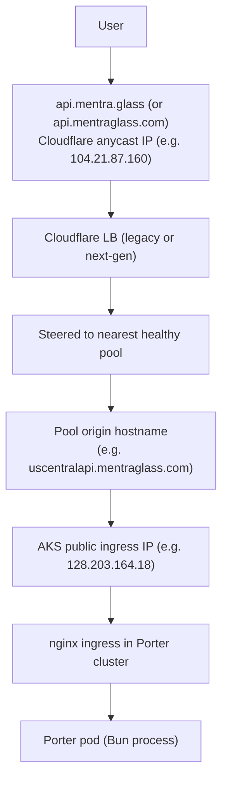

# Regional Load Balancers

We run two Cloudflare load balancers in front of the cloud.
Both route users to a Porter cluster in the nearest healthy
region. They share the same pool inventory but differ in
hostname and steering policy. One is the legacy LB that the
mobile app currently uses; the other is the next-gen LB on the
new domain that we plan to migrate the mobile app to.

| LB | Hostname | Steering | Status |
| --- | --- | --- | --- |
| Legacy (active) | `api.mentra.glass` | `geo` | Mobile app points here today |
| Next-gen (target) | `api.mentraglass.com` | `proximity` | No production customers yet; planned migration target |

The mobile app currently points at `api.mentra.glass`. Anything
that lives only on `api.mentraglass.com` (today: the `us-west`
pool in WNAM) is reachable but not getting real production
traffic. The migration plan is to flip the mobile app to
`api.mentraglass.com` once we are confident in the next-gen LB
and the regions wired into it.

### Why two LBs

The next-gen LB exists because the legacy one's `geo` steering
is too coarse. `geo` only lets us route by Cloudflare's
predefined regions (`WNAM`, `ENAM`, `WEU`, etc.), which means
all of North America gets two buckets, all of Europe gets two,
and so on. There is no way to differentiate "user in Seattle"
from "user in Chicago" in `WNAM`. They both go to whichever
single pool we mapped `WNAM` to.

`proximity` steering, used on the next-gen LB, picks the
closest healthy pool by great-circle distance from the user's
resolver to the pool's lat/long. As we add more regional pools
the next-gen LB automatically routes users to the closest one
without us having to redraw region maps. It also fails over
more gracefully if a pool is unhealthy because the second-
closest pool is the natural fallback.

We are not running both LBs forever. The plan is: get
proximity steering proven, finish wiring the regions we want,
then cut the mobile app over and retire the legacy LB.

> Values in this doc were pulled live from the Cloudflare API
> and the Porter CLI. Treat tables as a snapshot. Re-pull with
> the commands at the bottom of this doc when verifying state.

## Traffic flow



TLS terminates at Cloudflare. Cloudflare opens a backend
connection to the pool origin. The origin hostname resolves to
the AKS LoadBalancer service IP for that cluster's nginx
ingress. Each cluster's `cloud-prod` app declares the LB
hostnames as domains, so nginx accepts traffic for them and
routes to the cloud pod.

## What we have today

### Legacy LB: `api.mentra.glass`

| Field | Value |
| --- | --- |
| Zone | `mentra.glass` |
| LB ID | `0d6e09e5427a8b94d3ce47f58496e1b8` |
| Proxied | yes (orange cloud) |
| Steering policy | `geo` (Cloudflare regions to pool list) |
| Session affinity | `ip_cookie`, TTL 3600s |
| Adaptive routing | failover across pools disabled |
| Fallback pool | `asiaeast` |

Region steering:

| CF region | Covers | Pool used |
| --- | --- | --- |
| `WNAM` | West North America | `uscentral` |
| `ENAM` | East North America | `uscentral` |
| `NSAM` / `SSAM` | The Americas, south | `uscentral` |
| `WEU` / `EEU` | Europe | `france` |
| `OC` / `ME` | Oceania, Middle East | `asiaeast` |
| (other) | Africa, Asia (non-ME) | `asiaeast` (fallback) |

`us-west` is NOT in any region's pool list on this LB. WNAM
traffic goes to `uscentral`.

### Next-gen LB: `api.mentraglass.com`

| Field | Value |
| --- | --- |
| Zone | `mentraglass.com` |
| LB ID | `b34e8b4b2d960e78ba48fa235f4742c2` |
| Proxied | yes (orange cloud) |
| Steering policy | `proximity` (great-circle distance to pool lat/long) |
| Session affinity | `ip_cookie`, TTL 3600s |
| Fallback pool | `uscentral` |

Region steering (mostly mirrors the legacy LB, except WNAM):

| CF region | Pool used |
| --- | --- |
| `WNAM` | `us-west` |
| `ENAM` | `uscentral` |
| `NSAM` / `SSAM` | `uscentral` |
| `WEU` / `EEU` | `france` |
| `OC` / `ME` | `asiaeast` |

The two LBs differ in two places:

1. **Steering policy.** Legacy uses `geo` (each Cloudflare
   region maps to one pool, fixed). Next-gen uses `proximity`
   (Cloudflare picks the closest healthy pool by great-circle
   distance to the pool's lat/long). See "Why two LBs" above
   for the reasoning.
2. **WNAM pool.** Legacy routes WNAM to `uscentral`. Next-gen
   routes WNAM to `us-west`. Today this means `us-west` only
   receives traffic from clients pointing at
   `api.mentraglass.com`, which is no production client.

### Pools (shared between both LBs)

Pool inventory and per-pool steering can drift; for the live
state open the Cloudflare dashboard (or list pools via the API,
see "Adding a new region" below). The current pools, by
convention, are named after their region: `uscentral`,
`france`, `asiaeast`, `us-west`, `us-east`. Each pool has one
origin pointing at the matching cluster's nginx ingress via a
gray-cloud DNS record under `mentraglass.com`
(e.g. `uscentralapi.mentraglass.com`).

`us-east` is intentionally excluded from both LBs. The us-east
AKS cluster has insufficient nodes for the `cloud-prod`
workload and deploys often fail. The pool is left in place so
it is easy to enable later when capacity is fixed; until then
it has no monitor and is not wired into either LB's region map.

`us-west` is in the next-gen LB only. No production client
points at `api.mentraglass.com` today, so traffic to `us-west`
is essentially zero in practice. The mobile-app cutover (see
"Migrating the mobile app" below) is what turns `us-west` into
a real production region.

### Monitors

Each active pool has a monitor with the same shape: HTTPS GET
`/health`, 60s interval, 5s timeout, 2 retries, expecting 200.
`/health` is the cloud's readiness endpoint; a healthy region
responds well under the timeout.

### nginx ingress timeouts

Each Porter cluster's `cloud-prod` app sets these annotations on
its nginx ingress:

```yaml
ingressAnnotations:
  nginx.ingress.kubernetes.io/proxy-connect-timeout: "60"
  nginx.ingress.kubernetes.io/proxy-read-timeout: "3600"
  nginx.ingress.kubernetes.io/proxy-send-timeout: "3600"
```

The 3600-second read/send timeouts are what keep WebSocket
connections alive at the nginx layer. Cloudflare's idle timeout
is the tighter constraint (next section).

## The 100-second WebSocket idle timeout

Cloudflare drops idle WebSocket connections at around 100
seconds. If neither side sends a frame within that window the
connection is closed. The cloud and SDK exchange application-
level pings well under this interval, so it does not bite in
normal operation.

It bites in two cases:

1. A new ping cadence above 100s, or pings that get silenced
   somewhere in the stack.
2. A change to the SDK that defers pings until after the first
   user message. Always send pings unconditionally.

If WebSockets disconnect clustered exactly at 100 seconds,
application-level pings are misconfigured. Look at
`@mentra/sdk` and the cloud heartbeat logic.

## Porter clusters not in any LB

Some Porter clusters run `cloud-prod` but are not wired into
either LB. Their `cloud-prod` apps only have an auto-generated
`*.onporter.run` hostname.

| Porter cluster | Cluster ID | Status |
| --- | --- | --- |
| canada-central | 4753 | Provisioned, no LB pool, no API hostname domains |
| australia-east | 4978 | Provisioned, no LB pool, no API hostname domains |

If you want one of these to take traffic from either LB, follow
"Adding a new region" below. The work is the same as a new
cluster, except the cluster already exists.

## Adding a new region

End-to-end. Roughly: provision the AKS cluster in Porter,
deploy `cloud-prod` with regional domains, create a Cloudflare
pool + monitor + DNS record, plug the pool into one or both
LBs' region steering map.

For most new regions added today, plug into the next-gen LB
(`api.mentraglass.com`) first. That's the LB we are converging
on. Add to the legacy LB (`api.mentra.glass`) only if the
region needs to serve production traffic before the mobile app
cutover; that's a temporary state and the entry should be
removed from the legacy LB after the cutover.

### 1. Provision the AKS cluster in Porter

The Porter CLI does not create clusters. Use the dashboard:

1. Open https://dashboard.porter.run/
2. Project: `mentra` -> Add Cluster.
3. Pick Azure -> AKS -> the Azure region you want
   (e.g. South-East Asia, Brazil South, etc.).
4. Use the standard node SKU and node count we use elsewhere
   (verify against an existing cluster's settings).
5. Wait for provisioning (15-30 minutes).

Confirm the cluster exists:

```bash
porter cluster list
# new row appears with an ID, e.g. 5012 brazil-south
```

Note the cluster ID; you will pass it as `--cluster <ID>` for
the rest of this procedure.

### 2. Deploy `cloud-prod` to the new cluster

```bash
# From repo root, with the appropriate branch checked out
cd cloud

# The deployment target is auto-named <cluster-name>-default.
porter app create cloud-prod \
  --file ./porter.yaml \
  --cluster <NEW_CLUSTER_ID> \
  --target <region>-default

# Tail the running app's logs (use the dashboard's Activity tab
# for the build itself; `porter app logs` does not have a
# build-only flag).
porter app logs cloud-prod \
  --cluster <NEW_CLUSTER_ID> --target <region>-default
```

Once the build completes and the pod is Ready, find the
auto-generated `*.onporter.run` hostname:

```bash
porter app yaml cloud-prod \
  --cluster <NEW_CLUSTER_ID> --target <region>-default \
  | grep onporter.run
```

That hostname maps to the AKS LoadBalancer service IP for the
nginx ingress in this cluster. Resolve it to get the IP:

```bash
dig +short cloud-XXXX-XXXX.onporter.run
```

### 3. Create the regional API hostname

In Porter, edit the `cloud-prod` app for this cluster and add
the API hostnames to the `domains:` list. Include both LB
hostnames (so the cluster accepts requests from either LB) plus
the regional hostnames in both zones:

```yaml
domains:
  - name: api.mentra.glass            # legacy LB
  - name: api.mentraglass.com         # next-gen LB
  - name: <region>api.mentra.glass    # zone-internal regional
  - name: <region>api.mentraglass.com # the actual LB origin name
```

Replace `<region>` with the slug you'll use for the pool
(`brazilsouth`, `southeastasia`, etc.). Lowercase, no dashes,
matches the existing naming pattern.

In Cloudflare, add an A record in the `mentraglass.com` zone:

- Name: `<region>api`
- Type: A
- IPv4: the AKS LoadBalancer IP from step 2
- Proxy: gray cloud (DNS only)

The origin hostname must NOT be proxied. The Cloudflare LB needs
to reach the origin directly to send traffic.

Optional: also add `<region>api.mentra.glass` in the `mentra.glass`
zone, gray cloud, same IP. Useful if you want a direct-access
hostname; not strictly required for the LB to work since the LB
uses the `mentraglass.com` origin.

Verify:

```bash
dig +short <region>api.mentraglass.com
# should return the AKS IP, not a Cloudflare IP

curl -I https://<region>api.mentraglass.com/health
# 200 OK
```

### 4. Create the Cloudflare LB pool

```bash
CF_TOKEN=$(doppler secrets get CLOUDFLARE_LB_API_TOKEN \
  --project mentra-sre --config dev --plain)
ACCOUNT_ID=3c764e987404b8a1199ce5fdc3544a94

# Create the monitor first (the pool references it)
curl -X POST "https://api.cloudflare.com/client/v4/accounts/$ACCOUNT_ID/load_balancers/monitors" \
  -H "Authorization: Bearer $CF_TOKEN" \
  -H "Content-Type: application/json" \
  -d '{
    "type": "https",
    "description": "<Region> Monitor",
    "method": "GET",
    "path": "/health",
    "interval": 60,
    "timeout": 5,
    "retries": 2,
    "expected_codes": "200",
    "follow_redirects": false,
    "allow_insecure": false
  }'
# returns { "result": { "id": "<MONITOR_ID>", ... } }

# Then create the pool
curl -X POST "https://api.cloudflare.com/client/v4/accounts/$ACCOUNT_ID/load_balancers/pools" \
  -H "Authorization: Bearer $CF_TOKEN" \
  -H "Content-Type: application/json" \
  -d '{
    "name": "<region-slug>",
    "description": "<Region> Cloud",
    "enabled": true,
    "minimum_origins": 1,
    "monitor": "<MONITOR_ID>",
    "latitude": <approximate-latitude>,
    "longitude": <approximate-longitude>,
    "origins": [
      {
        "name": "<region-slug>",
        "address": "<region>api.mentraglass.com",
        "enabled": true,
        "weight": 1
      }
    ]
  }'
# returns { "result": { "id": "<POOL_ID>", ... } }
```

Pool name conventions: lowercase, matches the regional hostname
slug. Latitude/longitude can be approximate; Cloudflare uses
them for proximity steering only.

### 5. Plug the pool into one or both LBs

The Cloudflare GET response wraps the LB config in
`{"result": {...}, "success": true, ...}`. The PUT endpoint
expects just the LB object (the contents of `result`), not the
wrapper. Strip it with `jq '.result'` (or python) before saving
to disk.

To wire a pool into the legacy LB:

```bash
LEGACY_LB_ID=0d6e09e5427a8b94d3ce47f58496e1b8
LEGACY_ZONE=5bb5c71a90dc175143eb10edaad85d49

# Fetch current state, strip the response wrapper, save the LB
# object so we can edit it.
curl -s "https://api.cloudflare.com/client/v4/zones/$LEGACY_ZONE/load_balancers/$LEGACY_LB_ID" \
  -H "Authorization: Bearer $CF_TOKEN" \
  | jq '.result' > /tmp/legacy-lb.json

# Edit /tmp/legacy-lb.json: add <POOL_ID> to whichever region
# keys should route to it. Order matters: first healthy pool wins.
# e.g. for a Brazil cluster, change SSAM/NSAM:
#   "NSAM": ["<POOL_ID>", "<existing-uscentral-pool-id>"]

# PUT the LB back. Body is the unwrapped LB object.
curl -X PUT "https://api.cloudflare.com/client/v4/zones/$LEGACY_ZONE/load_balancers/$LEGACY_LB_ID" \
  -H "Authorization: Bearer $CF_TOKEN" \
  -H "Content-Type: application/json" \
  -d @/tmp/legacy-lb.json
```

To wire a pool into the next-gen LB, same procedure with
different IDs:

```bash
NEXTGEN_LB_ID=b34e8b4b2d960e78ba48fa235f4742c2
NEXTGEN_ZONE=86a59033615f078d613b3cd22fd30c44

curl -s "https://api.cloudflare.com/client/v4/zones/$NEXTGEN_ZONE/load_balancers/$NEXTGEN_LB_ID" \
  -H "Authorization: Bearer $CF_TOKEN" \
  | jq '.result' > /tmp/nextgen-lb.json
# edit
curl -X PUT "https://api.cloudflare.com/client/v4/zones/$NEXTGEN_ZONE/load_balancers/$NEXTGEN_LB_ID" \
  -H "Authorization: Bearer $CF_TOKEN" \
  -H "Content-Type: application/json" \
  -d @/tmp/nextgen-lb.json
```

Common pattern when bringing up a new region: put it in the
next-gen LB first (since that is where we are heading anyway).
Verify health under whatever traffic you can drive at it. Add
to the legacy LB only if the region needs to serve real
production users before the mobile-app cutover; that is a
temporary state, see "Migrating the mobile app" below.

### 6. Verify

The Cloudflare dashboard shows the LB's region map and the
pool's health. Confirm the new pool is listed as healthy and
that the region you wired routes to it.

A practical end-to-end check: from inside the new region's
network or via a VPN, hit whichever LB you added the pool to,
then look at `bstack logs --region <new-region-slug>` to
confirm the request landed on the right cluster.

## Adding a cluster to an existing region

Sometimes you want to scale a region by adding a second cluster
behind the same pool. Less common; the steps shorten:

1. Provision the new AKS cluster (step 1 above).
2. Deploy `cloud-prod` with the same domain list as the existing
   regional cluster (step 2 + 3 above; reuse the regional
   hostname, do not invent a new one).
3. Add a second origin to the existing pool. Same wrapper-
   stripping pattern as the LB edits above (PUT expects the
   pool object, not the response wrapper):

```bash
# Fetch current pool state, strip the response wrapper
curl -s "https://api.cloudflare.com/client/v4/accounts/$ACCOUNT_ID/load_balancers/pools/<POOL_ID>" \
  -H "Authorization: Bearer $CF_TOKEN" \
  | jq '.result' > /tmp/pool.json

# Edit /tmp/pool.json: append to "origins": [...] with weight 1
# and address pointing at the new cluster's regional hostname.

# PUT the pool. Body is the unwrapped pool object.
curl -X PUT "https://api.cloudflare.com/client/v4/accounts/$ACCOUNT_ID/load_balancers/pools/<POOL_ID>" \
  -H "Authorization: Bearer $CF_TOKEN" \
  -H "Content-Type: application/json" \
  -d @/tmp/pool.json
```

The pool then load-balances within itself across the two
clusters. Session affinity (`ip_cookie`) keeps a user pinned to
one cluster for the affinity TTL.

## Migrating the mobile app

The end-state for both LBs is to retire the legacy one. The
mobile app currently resolves the API via `api.mentra.glass`;
we want to flip it to `api.mentraglass.com` once the next-gen
LB has been validated under real load.

### Why this matters

Today only the next-gen LB has `us-west` wired into its WNAM
pool. So a west-coast user's geographic latency advantage from
us-west doesn't apply: their traffic is going through the
legacy LB to `uscentral`. Same for any future region we
configure on the next-gen LB only. The migration is what
unlocks the proximity steering benefit for real users.

### Pre-cutover checks

1. Both LBs return 200 for `/health` from the user's region:
   ```bash
   curl -i https://api.mentra.glass/health
   curl -i https://api.mentraglass.com/health
   ```
2. Cluster capacity is validated under load. The next-gen LB's
   `us-west` pool today serves essentially zero traffic, so the
   us-west cluster has not been load-tested in production.
3. All nginx ingress configs across regional clusters list both
   LB hostnames in their `domains:`. Verify with:
   ```bash
   for tuple in "4978 australia-east-default" "4696 france-default" \
                "4689 default" "4977 us-east-default" \
                "4754 east-asia-default" "4965 us-west-default" \
                "4753 canada-central-default"; do
     cid=$(echo "$tuple" | awk '{print $1}')
     tgt=$(echo "$tuple" | awk '{print $2}')
     echo "--- cluster $cid ---"
     porter app yaml cloud-prod --cluster $cid --target $tgt 2>/dev/null \
       | grep -E "name: api\\.mentra\\.glass|name: api\\.mentraglass\\.com" || \
       echo "  MISSING ONE OR BOTH LB HOSTNAMES"
   done
   ```
4. Both LBs report all pools healthy. See "Check pool health"
   below.

### Cutover

Mobile app side:

1. Change the API base URL in the mobile app from
   `https://api.mentra.glass` to `https://api.mentraglass.com`.
2. Ship a release. Mobile app update flow takes time; users on
   stale builds keep hitting the legacy LB until they update.
3. Both LBs stay live during the migration window. Do not
   touch the legacy LB until the rollout is far enough along.

Cloud side:

- No change required. Each cluster's nginx ingress already
  accepts both hostnames, so traffic from either LB lands the
  same way.

### Post-cutover

Once nearly all mobile clients are on the new build:

1. Watch traffic split between the two LBs in BetterStack.
   Look at `bstack` queries that group by host header.
2. After a soak period (weeks, not days, because of mobile
   update lag), retire the legacy LB:
   - Delete the `api.mentra.glass` LB record.
   - Optionally keep the `mentra.glass` zone for legacy
     redirects; the zone itself doesn't need to go.

### Promoting `us-west` and re-enabling `us-east`

These are essentially the same procedure: take an existing pool
that is not currently serving traffic and add it to one or both
LBs' region maps.

For `us-west`: it already has a monitor and is healthy; the
work is just adding the pool ID to the legacy LB's WNAM region
list (or waiting for the mobile cutover, which makes this
unnecessary).

For `us-east`: the AKS cluster needs more capacity first
(deploys often fail today). Once that is resolved, also attach
a monitor to the pool (it has none today), then add to a region
map. Use the standard "Adding a new region" pool / monitor /
region-map procedure above; the only "new" step versus a brand
new region is that the pool already exists.

Both are temporary states until the mobile cutover plus
capacity work converge.

## Common operational tasks

### Drain a pool (stop sending it new traffic)

Disable the pool. Existing connections stay; new ones go
elsewhere.

```bash
curl -X PATCH "https://api.cloudflare.com/client/v4/accounts/$ACCOUNT_ID/load_balancers/pools/<POOL_ID>" \
  -H "Authorization: Bearer $CF_TOKEN" \
  -H "Content-Type: application/json" \
  -d '{"enabled": false}'
```

To re-enable, set `enabled` back to `true`. Disabling the pool
affects both LBs since they share the inventory.

### Disable a single origin in a pool

Open the pool in the Cloudflare dashboard and toggle the
origin's "Enabled" switch off. Useful when a pool has multiple
origins and you want to drain just one cluster while leaving
the rest serving.

### Pool health

The Cloudflare dashboard's pool page shows current health and
per-origin status. If a pool flips unhealthy, the LB stops
sending it traffic; Cloudflare keeps health-checking and the
pool comes back when `/health` returns 200 again. For the
underlying cause, see `cloud/tools/bstack/runbooks/pod-crash.md`.
