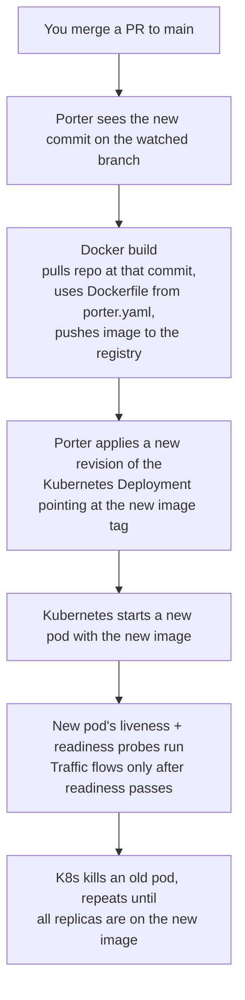

# Porter: Concepts and Prerequisites

Read this first if you are new to the stack. Operational
procedures live in [deploys.md](deploys.md), [env-vars.md](env-vars.md), and [logs.md](logs.md).

The summary: the cloud runs on Kubernetes clusters in Azure.
Porter is the platform that builds Docker images, deploys them
to those clusters, and gives us a UI/CLI on top of Kubernetes.
Each Porter "app" maps to a Kubernetes Deployment.

If those words are unfamiliar, the rest of this doc explains
each one.

## Docker container

A container is a process running with its filesystem and
dependencies bundled into an image. The image is built from a
Dockerfile (see `cloud/docker/Dockerfile.porter`). The
container is the running instance of that image.

For us, the cloud Bun process runs inside a container. The
image contains Bun, the cloud's source code, its dependencies,
and a `start.sh` entrypoint.

## Kubernetes (K8s)

Kubernetes is a container orchestrator. It runs containers on
a fleet of VMs ("nodes"), restarts them when they crash,
spreads them across nodes for resilience, and routes traffic
to them via its own networking primitives.

The Kubernetes objects you encounter in our setup:

### Node

One VM in the cluster. Has CPU, RAM, disk, an IP address.
Multiple pods share a node's resources. A cluster has one or
more nodes.

### Pod

The unit of work. A pod runs one or more containers
(usually one). Each pod is one process; the cloud-prod app's
pods each run one Bun process.

When a pod crashes Kubernetes restarts it. When a pod is
"rolled" during a deploy, K8s starts a new pod with the new
image and kills the old one only after the new one is Ready.

### Deployment

Manages pod replicas and rolling updates. The Deployment is
the desired state ("3 replicas of this image"); Kubernetes
makes the live state match.

A Porter "app" maps to a Deployment.

### Service

Internal Kubernetes networking. Routes traffic between pods
within the cluster. Each service has a stable internal name
(e.g. `cloud.default.svc.cluster.local`) that resolves to
whichever pods are currently part of the service.

### Ingress

External Kubernetes networking. Routes external HTTP/WebSocket
traffic from the internet to the right service. We use the
nginx ingress controller. Each Porter app declares which
hostnames it accepts traffic for in its `domains:` list.

The nginx ingress is what listens on the AKS LoadBalancer's
public IP (e.g. `128.203.164.18`). Cloudflare's regional LB
sends traffic to that IP; nginx routes by hostname to the
right service; the service routes to the right pods.

### DaemonSet

A different shape from Deployment: runs exactly one pod per
node, automatically. Used for things that need node-level
access (log collectors, metrics agents). The BetterStack
Vector pods run as a DaemonSet. See [../betterstack/concepts.md](../betterstack/concepts.md).

### Liveness probe

Kubernetes periodically hits an endpoint to check if the
process is alive. After enough consecutive failures, K8s
restarts the pod. The restart is graceful: SIGTERM first, then
up to `terminationGracePeriodSeconds` (10s in our `porter.yaml`)
for the process to exit on its own, then SIGKILL (exit 137) if
it has not. A misbehaving liveness probe can therefore terminate
in-flight WebSocket connections; the wedged pod is replaced
within ~10 seconds plus the new pod's startup time.

Our liveness probe: `GET /livez`, zero computation, 3-second
timeout. If `/livez` ever fails it is a real "process is
wedged" signal.

### Readiness probe

Kubernetes periodically hits an endpoint to check if the pod
can handle traffic. If it fails, K8s removes the pod from the
load balancer (nginx stops routing NEW requests to it) but
does NOT kill the pod. Existing WebSocket connections stay
alive.

Our readiness probe: `GET /health`, 5-second timeout. The
`/health` endpoint counts sessions, updates gauges, serializes
JSON. Heavier than `/livez`. A transient slowdown in `/health`
will fail the readiness probe; existing WebSockets keep
working but new REST requests get 503.

When the probe passes again, the pod is added back to the load
balancer.

## AKS (Azure Kubernetes Service)

Managed Kubernetes from Azure. We do not run the K8s control
plane ourselves; Azure does. Our nodes are Azure VMs in a
specific Azure region. A "Porter cluster" is one AKS cluster.

We have one AKS cluster per Porter region. See
`porter cluster list` for the live mapping.

## Porter

Porter sits on top of Kubernetes and provides:

- A web dashboard (https://dashboard.porter.run/) and CLI
  (`porter`)
- Docker builds: pushes the resulting image to a registry
  Porter manages
- Deployments: applies the image as a Kubernetes Deployment
- Rolling updates: starts new pods, waits for them to pass the
  readiness probe, kills old pods
- Environment variables: edit in the dashboard or the
  `porter.yaml`, the change rolls out on the next deploy
- Logs: tails container stdout in the dashboard
- Helm: under the hood Porter uses Helm releases to track each
  app. We rarely interact with this directly; the abstraction
  is "Porter app".

Each Porter app has a `porter.yaml` (or `porter-<region>.yaml`)
in the repo. That file declares the app's services, image
build, env vars, probes, and ingress hostnames. Pushing a
change to the watched branch triggers a new build + rolling
deploy.

## Multi-region

Production runs the `cloud-prod` app on five AKS clusters:
us-central, us-east (currently disabled), us-west (next-gen
LB only), france, east-asia. Each cluster watches `main` for
the `cloud-prod` app and rolls independently when `main`
advances.

The clusters do not share state directly. Users connect to a
single cluster (steered by Cloudflare's regional LB) and stay
there for their session.

## Image registry

Built images are pushed to an Azure-hosted registry that
Porter manages (image names like
`p15081loccentralussub83c25aaff6.azurecr.io/...`). Each region
has its own registry instance to keep image pulls local
(otherwise pulling a multi-GB image across continents would be
slow). You do not interact with the registry directly; Porter
handles the build-tag-push.

## Helm under the hood

Porter uses Helm releases internally. You will see references
to Helm in the repo (e.g. `cloud/infra/betterstack-logs/values.yaml`
is a Helm chart we install separately for the BetterStack
Vector DaemonSet, see [../betterstack/concepts.md](../betterstack/concepts.md)). For our
day-to-day Porter operations, the abstraction is "Porter app";
the Helm release behind it is implementation detail.

## How a deploy actually flows

If the readiness probe never passes (e.g. the new code crashes
on startup), the rollout halts and the old pods keep serving.
You can roll back from the Porter dashboard.
