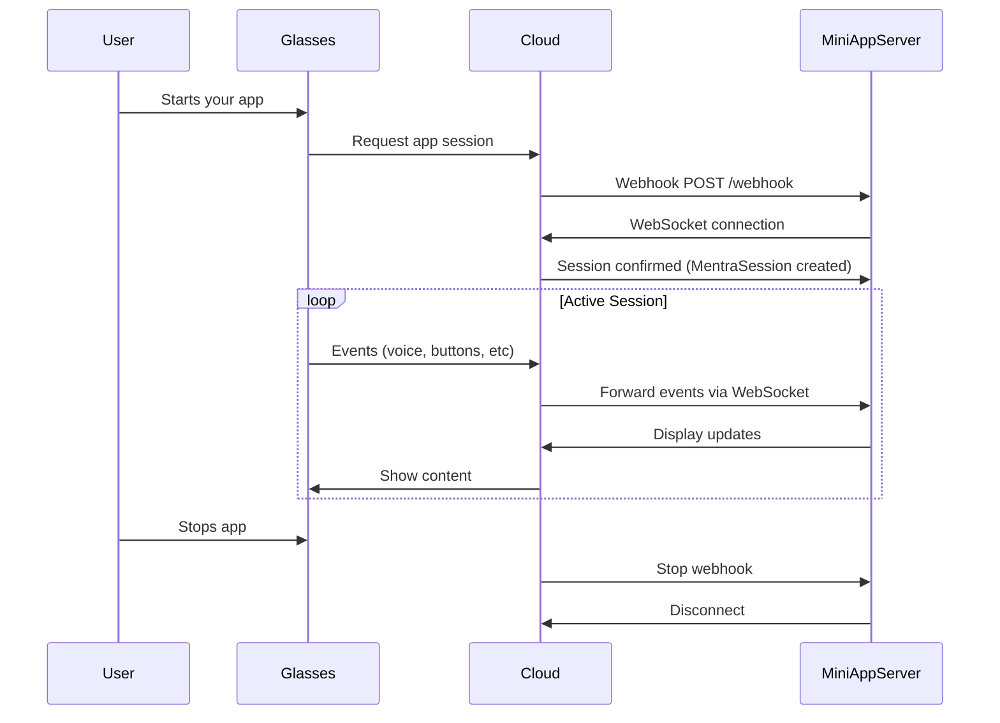

## How It Works



## Lifecycle Stages

### 1. Registration (One-Time Setup)

Register your app in the [Developer Console](https://console.mentra.glass/apps):

- **Package Name**: Unique identifier (e.g., `com.example.myapp`)
- **Webhook URL**: Where MentraOS sends session requests
- **API Key**: Secret for authentication
- **Permissions**: What device data your app needs

### 2. Session Start

**When a user starts your app:**

1. MentraOS Cloud sends HTTP POST to your webhook URL
2. Webhook includes `sessionId` and `userId`
3. Your server establishes WebSocket connection
4. Your server sends connection init message
5. Cloud confirms connection

```typescript
// The SDK handles this automatically
app.onSession((session: MentraSession) => {
  // Your app logic starts here
  session.logger.info("Session started!");
});
```

### 3. Active Session

**While the session is active:**

- Subscribe to events (transcription, button presses, etc.)
- Handle incoming events with callbacks
- Update the display
- Access device capabilities

```typescript
app.onSession((session: MentraSession) => {
  // Subscribe to voice transcription
  session.transcription.on((data) => {
    session.logger.info("User said:", data.text);
  });

  // Update display
  session.display.showTextWall("App is running!");
}
```

### 4. Session End

**Session ends when:**

- User stops the app
- Glasses disconnect
- Network error occurs
- Your server disconnects

```typescript
app.onStop((session, reason) => {
  // Clean up resources
  console.log("Session ended:", reason);
});
```

In v3, sessions can also reconnect after a brief transport blip without ending:

```typescript
app.onSession((session) => {
  session.onReconnected(() => {
    // Connection restored — subscriptions still active
  });

  session.onStopped((reason) => {
    // Session truly ended — clean up per-user state
  });
});
```

## Key Components

| Component | Purpose |
|-----------|---------|
| **MiniAppServer** | Your server that handles webhooks and connections |
| **MentraSession** | One user's active connection to your app |
| **Session Managers** | Typed interfaces for each capability (transcription, display, camera, etc.) |
| **WebSocket** | Real-time bidirectional communication between your server and MentraOS Cloud |

## Important Notes

<Info>
Sessions are isolated per user. Each user who starts your app gets their own `MentraSession` instance with a unique `userId`. Nothing leaks between users.
</Info>

## Next Steps

<CardGroup cols={2}>
  <Card title="MiniAppServer" icon="server" href="/app-devs/core-concepts/app-server">
    The entry point for your app
  </Card>
  <Card title="Learn About AppSession" icon="plug" href="/app-devs/core-concepts/app-session/app-session">
    Work with individual user sessions
  </Card>
  <Card title="Handle Events" icon="bolt" href="/app-devs/core-concepts/app-session/events-and-data">
    Subscribe to real-time data from glasses
  </Card>
  <Card title="Set Permissions" icon="lock" href="/app-devs/core-concepts/permissions">
    Control what data your app can access
  </Card>
</CardGroup>

## Quick Example

Here's a minimal MentraOS app:

```typescript
import { AppServer, AppSession } from '@mentraos/sdk';

class HelloGlasses extends AppServer {
  protected async onSession(session: AppSession, sessionId: string, userId: string) {
    // Show greeting
    session.layouts.showTextWall('Hello from MentraOS!');

    // Listen for voice input
    session.events.onTranscription((data) => {
      if (data.isFinal) {
        session.layouts.showTextWall(`You said: ${data.text}`);
      }
    });
  }

  protected async onStop(sessionId: string, userId: string, reason: string) {
    console.log(`Session ${sessionId} ended: ${reason}`);
  }
}

// Start server
const server = new HelloGlasses({
  packageName: 'com.example.helloglasses',
  apiKey: process.env.MENTRAOS_API_KEY!,
  port: 3000
});

server.start();
```

This app greets the user and echoes back their voice input. Simple, but it demonstrates the complete lifecycle.
